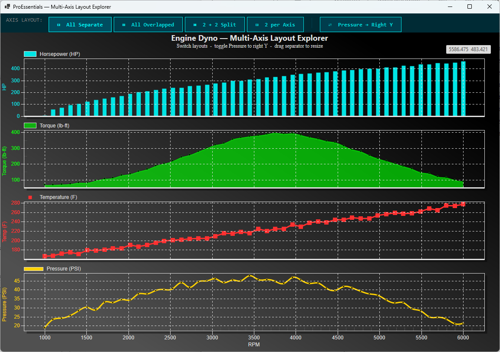

# Multi-Axis Layout Explorer — WinForms

ProEssentials v10 **WinForms .NET 8** — a single `Pesgo` scientific chart
displaying engine dyno data (HP, Torque, Temperature, Pressure vs RPM) across
**four instantly switchable axis layout modes**, with a toggle that moves
Pressure to the right Y axis in whichever layout is active. Mixed plotting
methods per subset (Bar, SplineArea, PointsPlusLine, Spline). Direct2D.

---

## What This Demonstrates

- **Four live-switchable multi-axis layouts** in one chart:
  - **All Separate** — 4 independent stacked Y axes (Examples 012 / 103)
  - **All Overlapped** — 4 series share one Y region, each with its own scale (Example 103)
  - **2 + 2 Split** — HP+Torque on top, Temp+Pressure below (Example 104)
  - **2 per Axis** — two axis sections, two series each (Example 013)
- **`PePlot.Methods[]`** assigns a plotting method per subset — *not*
  `WorkingAxis`-dependent. Adding `OnRightAxis` (1000) routes a subset to the
  right Y axis with no `ComparisonSubsets` involved.
- **Code-built UI** — the entire form is constructed in C# (no `.Designer.cs`,
  no `.resx`), so the project builds and runs without invoking the Visual
  Studio WinForms designer.

---

## WinForms vs WPF

This is the WinForms sibling of the WPF Multi-Axis Layout Explorer. The
ProEssentials chart configuration is **identical** between the two — only the
host shell differs (WinForms `FlowLayoutPanel` + docked chart vs WPF `Grid`).

➡️ WPF version: [wpf-chart-multi-axis-layout-explorer-proessentials](https://github.com/GigasoftInc/wpf-chart-multi-axis-layout-explorer-proessentials)

---

## Prerequisites

- Visual Studio 2022
- .NET 8 SDK (Windows)
- Internet connection for NuGet restore
- x64

---

## How to Run

1. Clone this repository
2. Open `MultiAxisLayoutExplorer.sln` in Visual Studio 2022
3. Build → Rebuild Solution (restores the NuGet package automatically)
4. Press F5
5. Click the toolbar buttons to switch axis layouts; toggle Pressure → Right Y

> **Designer note:** This project has no `.Designer.cs` file by design — the UI
> is built in code in `MainForm.cs`. There is nothing for the WinForms designer
> to open, which avoids the native-control designer issues entirely.

---

## NuGet Package

References [`ProEssentials.Chart.Net80.x64.Winforms`](https://www.nuget.org/packages/ProEssentials.Chart.Net80.x64.Winforms)
from nuget.org. Package restore happens automatically on build.

---

## License

Example code is MIT licensed. ProEssentials requires a commercial license for
continued use.
